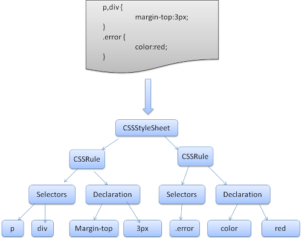
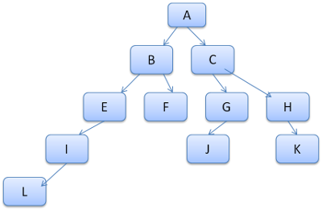
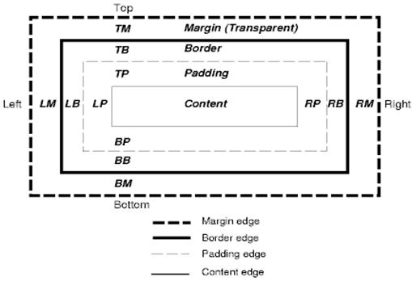
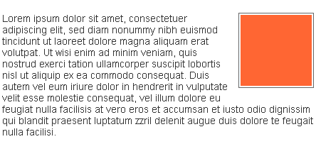

.. Translation of "How Browsers Work" documentation master file, created by
   sphinx-quickstart on Fri Aug 19 00:54:08 2011.
   You can adapt this file completely to your liking, but it should at least
   contain the root `toctree` directive.

How Browsers Work - Behind the Scenes of Modern Web Browsers
==============================================================

この翻訳について
--------------------------------------------------------------

この文章は `HTML5 Rocks <http://www.html5rocks.com/>`_ で公開されている `How Browsers Work: Behind the Scenes of Modern Web Browsers <http://www.html5rocks.com/en/tutorials/internals/howbrowserswork/>`_ を非公式に和訳したものです. 内容の正確性は保証しません. ライセンスは原文と同じく, 文章は `Creative Commons Attribution 3.0 License <http://creativecommons.org/licenses/by/3.0/>`_ , サンプルコードは `Apache 2.0 License <http://www.apache.org/licenses/LICENSE-2.0>`_ です. フィードバックは `Issue への登録 <https://github.com/cou929/Japanese-Translation-of-How-Browsers-Work/issues>`_ , あるいは `Kosei Moriyama <http://cou929.nu/>`_ (`@cou929 <http://twitter.com/cou929>`_ または cou929 at gmail.com) へ直接お願いします. GitHub に `この和訳のリポジトリ <https://github.com/cou929/Japanese-Translation-of-How-Browsers-Work>`_ があります.

以下の Preface でも言及されていますが, この文章は `Tali Garsiel <http://taligarsiel.com/>`_ さんが自身のサイトで公開していたものを `Paul Irish <http://paulirish.com/>`_ さんが "より多くの人の目に届けるため" に HTML5 Rocks で再公開したものです. すばらしいドキュメントを書いてくれた Tali さん, 及びその文章を知るきっかけを提供してくれた Paul さんに感謝します.

Author, Editor
--------------------------------------------------------------

* Tali Garsiel (author) - Developer, Incapsula,
* Paul Irish (editor) - Developer Relations, Google

Updated at (original document)
--------------------------------------------------------------

August 16, 2011

Preface
--------------------------------------------------------------

この WebKit と Gecko の内部動作についての包括的な入門書は, イスラエルの開発者 Tali Garsiel の多大な調査によるものです. 彼女は数年にわたりブラウザの内部に関する多くの文章を読み (詳しくは Resources を参照), またブラウザのコードを読むことにも多くの時間を費やしました. 彼女はこう書いています: 

   IE が 90% のシェアを占めていたの時代, 多くのことができませんでしたがブラウザは "ブラックボックス" と考えられていました. しかし現在はオープンソースのブラウザが `過半数のシェアを占めているので <http://techcrunch.com/2011/08/01/open-web-browsers/>`_ ブラウザの中身を覗くには良いタイミングです. ただし中身は何百万行の C++ コードでした…

彼女のこの調査は `彼女のサイト <http://taligarsiel.com/>`_ で公開されています. しかし私達はこの文章はより多くの人に読まれるべきと考え, `ここ <http://www.html5rocks.com/en/tutorials/internals/howbrowserswork/>`_ に再公開します.

Web 開発者とって **ブラウザの内部動作を知ることは, よりよい判断をすること・開発のベストプラクティスの背後にある理由を知る手助けになります**. この文章は長文になるので, より深掘りして読むことをお勧めします. そうすることで最後によかったと思えることを私たちは保証しましょう.

*Paul Irish, Chrome Developer Relations*

Introducion
--------------------------------------------------------------

ブラウザは最も広く使われているソフトウエアです. この入門書ではブラウザが裏でどのように動いているかを説明します. 私たちがアドレスバーに ``google.com`` とタイプしてから Google のページが表示されるまでに何が起こっているかを見ていきましょう.

The browsers we will talk about
**************************************************************

今日では IE, Firefox, Safari, Chrome, Opera という5つのメジャーブラウザがあります. ここではオープンソースのブラウザ - Firefox, Chrome, Safari (一部はオープンソースです) - を取り上げます. `StatCounter browser statistics <http://gs.statcounter.com/>`_ によると, 現在 (2011年8月) では Firefox, Safari, Chrome のシェアを合計すると 60% に達します. 今ではオープンソースのブラウザがブラウザビジネスの大きな部分を占めています.

The browser's main functionality
**************************************************************

ブラウザの主要機能はユーザが選択した Web のリソースを表示させることです. サーバにリクエストを出し, それをブラウザウィンドウに表示させます. リソースのフォーマットは通常は HTML ですが pdf や画像にも対応しています. リソースの場所はユーザによって URI (Uniform resource Identifier) で指定されます.

ブラウザがどのように HTML を解釈し表示するかは HTML と CSS ファイルで指定されています. その仕様は **W3C** (World Wide Web Consortium) によってメンテナンスされています. W3C は Web の標準化団体です.

数年にわたり各ブラウザは標準の全てに準拠せず, 独自の拡張を進めてきました. その結果, Web サイト制作者にとっては深刻なブラウザ互換の問題が引き起こされました. 今日では多くのブラウザがより仕様に準拠するようになっています.

各ブラウザのユーザインタフェースは多くの部分で共通しています. 代表的なものは以下です:

* URI を入力するアドレスバー
* 戻る・進むボタン
* ブックマーク機能
* 再読み込み・読み込み停止ボタン
* ホームボタン

奇妙なことにこれらのユーザインタフェースは仕様で定められているわけではありません. これらは長年のブラウザの歴史の中で互いに洗練されてきたグッドプラクティスです. HTML5 ではブラウザが持たなければいけない UI 要素は定義していませんが, アドレスバー・ステータスバー・ツールバーなど, 一般的な要素をリストアップしています. もちろん, Firefox のダウンロードマネージャのようにブラウザ特有の要素もあります.

The browser's high level structure
**************************************************************

ブラウザの主要コンポーネントは以下です [#ref1.1]_

1. **ユーザインタフェース** - アドレスバー, 戻る・進むボタン, ブックマークメニューなど, メインウィンドウに表示されるページ以外の部分.
2. **ブラウザエンジン** - UI とレンダリングエンジン間のアクションを制御するもの
3. **レンダリングエンジン** - リクエストしたコンテンツを表示させるもの. 例えばコンテンツが HTML の場合, HTML と CSS をパースし, パースしたコンテンツをスクリーンに表示させることに責任を持つ
4. **ネットワーク** - HTTP リクエストのようなネットワーク通信を行う. プラットフォーム非依存で, その差異を吸収している.
5. **UI バックグラウンド** - コンボボックスやウィンドウなど基本的な UI 要素. プラットフォーム非依存のインタフェースを提供する. 背後では OS の UI メソッドを使用している.
6. **JavaScript インタプリタ** - JavaScript をパースし実行する.
7. **データストレージ** - 永続的なレイヤー. クッキーなど, ある種のデータをハードディスクに保存する. HTML5 では *Web Database* など完全な (かつ軽量な) DB がブラウザで提供される.

.. figure:: _static/layers.png
   :alt: Browser main components
   
   Figure 1: Browser main components

Chrome は他のブラウザと異なり, タブごとに別のレンダリングエンジンのインスタンスを持ちます. つまりタブごとに別プロセスを立ち上げています.

The rendering engine
--------------------------------------------------------------

レンダリングエンジンの役割は…レンダリングです. つまりリクエストしたコンテンツをブラウザのスクリーンに表示させることです.

デフォルトではレンダリングエンジンは HTML, XML, 画像に対応しています. プラグイン (またはブラウザエクステンション) を入れることで PDF など別のフォーマットのデータも表示できます. しかしこの文章では主要なユースケースである CSS によってフォーマットされた HTML と画像のレンダリングについて扱います.

Rendering engines
**************************************************************

今回私たちが参考にする Firefox, Chrome, Safari は2つのレンダリングエンジンの上に構築されています. Firefox は Mozilla 製の **Gecko** を, Safari と Chrome は **WebKit** を使用しています.

WebKit はオープンソースのレンダリングエンジンです. もとは Linux で動作するように始まったものを Apple が Mac と Windows に対応するよう改良しました. 詳細は `webkit.org <http://webkit.org/>`_ を参照してください.

The main flow
**************************************************************

レンダリングエンジンはネットワークレイヤーからリクエストしたコンテンツを受け取ります. 通常 8K のチャンクです.

その後, 通常は次のようなフローを経ます.

.. figure:: _static/flow.png
   :alt: Rendering engine basic flow
   
   Figure 2: Rendering engine basic flow

レンダリングエンジンは HTML をパースしタグを **コンテントツリー** の DOM ノードに変換します. その後外部 CSS ファイルやスタイル要素の CSS をパースします. スタイルの情報が取り込まれ, **レンダーツリー** という別の木が作成されます.

レンダーツリーは色や大きさといった属性値をもつ矩形を持っています. これらの矩形はスクリーンに表示される正しい並びで配置されています.

レンダーツリーができたあとはレイアウトプロセスに移行します. このプロセスでは各要素がスクリーン上のどの位置に表示されるかが決まります. 次は描画 (Painting) です. レンダーツリーが走査され, 各ノードが UI バックエンドレイヤーによって描画されます.

重要なのはこれらのプロセスが漸進的に実行されるということです. よりよいユーザ体験のためには, よりはやくコンテンツを表示させることが重要です. そのためすべての HTML がパースされるのを待たずにレンダーツリーを作り始めます. ネットワークから残りのコンテンツを受信している間に, 受信済みのコンテンツをパース・表示していきます.

gradual
**************************************************************

.. figure:: _static/webkitflow.png
   :alt: Webkit main flow
   
   Figure 3: Webkit main flow

.. figure:: _static/image008.jpg
   :alt: Figure : Mozilla's Gecko rendering engine main flow

   Figure 4: Mozilla's Gecko rendering engine main flow [#ref3.6]_

図3, 4 より WebKit と Gecko は違う用語をつかっていますが, 主な流れは大体同じということがわかります.

Gecko ではビジュアル要素のツリーを *Flame tree*  と呼んでいます. 各ノードはフレームです. WebKit では *Render tree* で, 各ノードは *Render Object* です. WebKit ではその要素の配置を行うことは *Layout* と呼ばれますが, Gecko では  *Reflow* です. DOM ノードとビジュアル要素をつなげレンダーツリーを作る過程は, WebKit では *Attachment* と呼ばれます. また Gecko は HTML と DOM ツリーの間に *Content sink* という, DOM 要素を作る別のレイヤーを持っています. 次章以降ではこれらのフローをそれぞれ見ていきます.

Parsing and DOM tree construction
--------------------------------------------------------------

Parsing - general
**************************************************************

パース (構文解析) はレンダリングエンジンのなかでも特に重要な部分なので, より深く見ていきましょう. まずはパースについての簡単なイントロダクションから始めます.

文章をパースするとは, 文章を意味のある構造に変換するということを意味します. "意味のある" とはコードから理解・利用できるという意味です. パースされた結果は通常文章の構造を表す木になります. この木構造はパースツリー・シンタックスツリー (構文木) と呼ばれます.

例として ``2 + 3 - 1`` という式をパースすると次のような木が得られます.

.. figure:: _static/image009.png
   :alt: mathematical expression tree node

   Figure 5: mathematical expression tree node

Grammars
##############################################################

パースはその対象の文章が従う構文ルールに基づいて行われます. パースできるフォーマットは必ず **語彙** (*vocabulary*) と **構文ルール** (*syntax rule*) から成る文法で記述できる必要があります. これは **文脈自由文法** (*Context free grammer*) と呼ばれるものです. 例えば自然言語はこのように文法を記述できないので, ここで述べるテクニックではパースできません.

Parser - Lexer combination
##############################################################

パースは字句解析と構文解析という2つのサブプロセスに分割できます.

字句解析は入力をトークンに分割するプロセスです. トークンとはその言語の語彙, つまりその言語の valid なかたまりのことです. 自然言語で例えるとその言語の辞書に載っている単語ということになります.

構文解析はその言語の構文ルールを適用するプロセスです.

パーサーは通常2つのコンポーネントに分割できます. 字句解析を行う **lexer** (あるいは tokenizer) と, 構文ルールに基づきパースツリーを作成する **parser** です. lexer は空白や改行などの関係のない文字を除くことも行います.

.. figure:: _static/image011.png
   :alt: from source document to parse trees

   Figure 6: from source document to parse trees

パースのプロセスは反復的です. parser は lexer から新たなトークンを受け取り, それを構文ルールにマッチさせます. もしいずれかのルールにマッチしたら, そのトークンに紐付くノードはパースツリーに追加され, parser は次のトークンを lexer から受け取ります.

もしルールにマッチしなかった場合, parser はそのトークンを内部的に保持し, 保持しているすべてのトークンがマッチするようなルールが見つかるまで繰り返します. もし最後までどのルールにもマッチしなかった場合例外が投げられます. つまりドキュメントが valid でなく, シンタックスエラーが起こったということです.

Translation
###############################################################

多くの場合パースツリーが最終目的ではありません. パースはトランスレーション, つまり入力されたドキュメントを別のフォーマットに変換するために使われます. コンパイルはその例です. コンパイラはソースコードをパースし, それを機械後に変換します.

.. figure:: _static/image013.png
   :alt: compilation flow

   Figure 7: compilation flow

Parsing example
###############################################################

図5 では数式からパースツリーを作成しました. ここではシンプルな数学言語を定義してパースのプロセスを見てみましょう.

まず語彙として, 私たちの言語は整数とプラス・マイナス記号を扱います.

言語の構文は:

1. 言語の構文は expressions, terms, operations から成ります
2. expression はいくつでも使えます
3. expression は "term opeation term" という形式です
4. operations は プラストークンかマイナストークンのいずれかです
5. term は整数トークン, または expression です

ここで ``2 + 3 - 1`` という式を分析してみましょう.

最初にルールにマッチするのは ``2`` という文字です. ルール 5 によりこれは term となります. 次にマッチするのは ``2 + 3`` です. これは3番目のルールにマッチします. 次にマッチするのはインプットの最後で ``2 + 3 - 1`` です. ``2 + 3`` が term であることはすでにわかっているので, これも "term operation term" のフォーマットになっていることがわかります. そして, 例えば ``2 + +`` というインプットはどのルールにもマッチしないので invalid な入力ということになります.

Formal definitions for vocabulary and syntax
###############################################################

語彙は通常 `正規表現 <http://www.regular-expressions.info/>`_ で表されます.

例えば上記の私たちの言語の語彙は次のようになります.::

   INTEGER :0|[1-9][0-9]*
   PLUS : +
   MINUS: -

このように INTEGER は正規表現で表されています.

構文は通常 `BNF <http://en.wikipedia.org/wiki/Backus%E2%80%93Naur_Form>`_ と呼ばれる記法で定義されます. 私たちの言語の場合は以下です.::

   expression :=  term  operation  term
   operation :=  PLUS | MINUS
   term := INTEGER | expression

文脈自由文法に従う文章は通常のパーサーでパースできると述べました. 文脈自由文法の直感的な説明は, BNF で完全に記述できる文法ということです. より形式的な定義は  `Wikipedia の Context-free grammer の項 <http://en.wikipedia.org/wiki/Context-free_grammar>`_ を参照してください.

Types of parsers
###############################################################

パーサーには一般的にトップダウンパーサ・ボトムアップパーサの二種類があります. 直感的に説明すると, トップダウンパーサは文法のハイレベルな構造から見ていき, そのうちのどれかにマッチさせていきます. ボトムアップパーサは入力データからスタートし徐々に文法をローレベルからハイレベルへ当てはめていきます.

上記の例を二種類のパーサに当てはめてみましょう.

トップダウンパーサは高いレベルのルールからスタートします. まず ``2 + 3`` が expression としてマッチし, 次に ``2 + 3 - 1`` がマッチします. (実際に expression がマッチするのは別のルールですが, スタート地点は最高レベルのルールからです)

ボトムアップパーサはルールにマッチするまで入力を読み取り, マッチした入力をルールで置き換えます. これを入力の最後まで続けます. マッチ途中の expression はパーサースタックに格納されます.

===================== ==============
Stack                 Input
===================== ==============
[empty]               ``2 + 3 - 1``
--------------------- --------------
term                  ``+ 3 - 1``
--------------------- --------------
term operation        ``3 - 1``
--------------------- --------------
expression            ``- 1``
--------------------- --------------
expression operation  ``1``
--------------------- --------------
expression              
===================== ==============

このタイプのボトムアップパーサは *Shift-reduce parser* とも呼ばれます. 入力が右にシフトし (最初ポインタが入力の先頭を指していて, 右に動いていくとイメージしてください) 構文ルールによって徐々に減っていくことからです.

Generating parsers automatically
###############################################################

パーサジェネレータというパーサを生成してくれるツールがあります. 自分の言語の文法 (語彙と構文) を渡すとパーサを作成してくれます. パーサをいちから作るには構文解析に対する深い理解が必要で, パーサーの最適化も簡単ではありません. よってパーサジェネレータは非常に有用なツールです.

WebKit は有名なパーサジェネレータである `Flex <http://en.wikipedia.org/wiki/Flex_lexical_analyser>`_ (lexer) と `Bison <http://www.gnu.org/software/bison/>`_ (パーサ生成) を使用しています. (Lex and Yacc という名前で聞いたことがある人もいるかも知れません). Flex の入力はトークンを定義する正規表現, Bison の入力は BNF です.

HTML Parser
****************************************************************

HTML パーサの仕事は HTML マークアップをパースしパースツリーを作ることです.

The HTML grammar definition
###############################################################

HTML の語彙と構文は W3C によって定義されています. 現在のバージョンは HTML4 で HTML5 の策定が進行中です.

Not a context free grammar
###############################################################

前節のパーサーのイントロダクションではグラマーは BNF など形式的なフォーマットで表現できると述べました.

しかしこれは HTML には当てはまりません (しかしただ単に趣味でパーサーについて説明したわけではありません. CSS と JavaScript は前述の方法でパースされています). HTML は文脈自由文法では簡単に表現できないからです.

DTD (Document Type Definition) と呼ばれる HTML の形式的な定義があります. しかしこれは文脈自由文法ではありません.

HTML は XML と似ているので, これがおかしなことに思えるかもしれません. XML のパーサはたくさんあります. それにXML のバリエーションの1つである XHTML もあるくらいです. では XML と HTML の大きな違いとは何なのでしょうか.

違いは HTML が "寛容" であることです. 開きタグ, 閉じタグが抜けていても暗黙に補完してくれたりします. XML の固く厳しい構文に比べ, HTML は Soft です.

この小さな違いは 2 つの大きく違う世界を生み出しています. 片面はこのことによって HTML がここまで広く使用されることになったということです. HTML はミスに寛容で Web サイト制作者はとても簡単に Web サイトを作成できます. 一方で文法を形式的に記述することが非常に難しくなっています. HTML をパースするのは簡単ではなく, 通常のパーサや XML パーサをそのまま適用することはできません.

HTML DTD
###############################################################

HTML は DTD 形式で定義されています. これは `SGML <http://en.wikipedia.org/wiki/Standard_Generalized_Markup_Language>`_ ファミリーを定義するのに使われるフォーマットです. このフォーマットではすべての許可される要素とその属性, 及びヒエラルキーが定義されています. 前述のように DTD は文脈自由文法を形成しません.

DTD にはいくつかのバージョンがあります. strict モードは単独で標準に準拠しますが, 他に過去のブラウザで使われていたマークアップを含むものもあります. これは古いコンテンツの後方互換性のためです. 現在の strict な DTD はこちらです `www.w3.org/TR/html4/strict.dtd <http://www.w3.org/TR/html4/strict.dtd>`_ .

DOM
###############################################################

HTML をパースすると **パースツリー** という木構造のデータが出力されます. このツリーのノードは DOM 要素とその属性です. DOM とは Document Object Model の略です. DOM は HTML ドキュメントのオブジェクト表現で JavaScript などの外部から HTML 要素を操作するためのインタフェースです. DOM ツリーのルートは `Document <http://www.w3.org/TR/1998/REC-DOM-Level-1-19981001/level-one-core.html#i-Document>`_ オブジェクトです.

DOM はマークアップとほぼ 1 対 1 の関係になります. 例えば以下のマークアップは

.. code-block:: html

   <html>
     <body>
       

         Hello World
       

       
 

     </body>
   </html>

このような DOM ツリーになります.

.. figure:: _static/image015.png
   :alt: DOM tree of the example markup

   Figure 8: DOM tree of the example markup

HTMLと同様に DOM も W3C で仕様が策定されています. `<http://www.w3.org/DOM/DOMTR>`_ を参照してください. これは HTML に限らず一般的な文章を操作するための仕様です. HTML 特有の仕様は `<http://www.w3.org/TR/2003/REC-DOM-Level-2-HTML-20030109/idl-definitions.html>`_ です.

この文章で私が DOM ノードを含むツリーのことを言う時は, その要素が DOM インタフェースのいずれかの実装である木のことを意味します. ブラウザはブラウザ内部で使う属性を含んだ実装をしています.

The parsing algorithm
###############################################################

前述のように HTML はトップダウンパーサ・ボトムアップパーサではパースができません. その理由は,

1. 言語の寛容な特性のため
2. invalid な HTML をサポートするためにエラーに対して寛大にならないといけないため
3. 再入可能なパースプロセスのため. 通常パースが完了するまで入力は変化しませんが, 例えば script 要素に ``document.write`` がある場合など, パース中にも入力が変化します.

このように通常のテクニックが使えないので, ブラウザは HTML をパースするのにカスタムパーサを用いています.

`パースのアルゴリズムは HTLM5 の仕様で詳しく説明されています <http://www.whatwg.org/specs/web-apps/current-work/multipage/parsing.html>`_ . アルゴリズムは *tokenization*, *tree construction* の2つにわかれます.

tokenization では字句解析を行い入力をトークンに分割します. HTML のトークンは開始タグ, 終了タグ, 属性名, 属性値などです.

tokenizer は新たなトークンを認識し次第それを tree constructer に渡し次の入力を読み込んでいきます. これを入力が終わるまで続けます.

.. figure:: _static/image017.png
   :alt: HTML parsing flow (taken from HTML5 spec)

   Figure 9: HTML parsing flow (taken from HTML5 spec)

The tokenization algorithm
###############################################################

アルゴリズムの出力は HTML トークンです. アルゴリズムはステートマシンとして表現できます. 各状態は入力の 1 つ以上の文字を消費し, その文字に応じて次の状態へ遷移します. 遷移のルールはその時のトークンの状態と tree constructer の状態によって決まります. つまり同じトークンが来ても状態に応じて違う結果になりうるということです. アルゴリズム全体を扱うのは非常に複雑なので, 原理を理解しやすいようシンプルな例を見てみましょう.

次の HTML を tokenize すると考えてください.

.. code-block:: html

   <html>
     <body>
       Hello world
     </body>
   </html>

最初の状態は *Date state* です. ``<`` に達したとき状態は *Tag open state* に変わります. ``a-z`` の文字を消費し *Start tag token* を作ります. 状態は *Tag name state* に変わります. ``>`` に達するまではそのままの状態で, その間の文字はトークン名となります. この場合は ``html`` トークンです.

``>`` に到達したらその時のトークンが発行され状態は *Date state* に戻ります. ``<body>`` タグも同様に処理されます. Hello の ``H`` 文字から ``</body>`` の ``<`` まではキャラクタートークンです. 

この段階で *Tag open state* に戻っています. ``/`` に達したときに *End tag token* を作成し *Tag name state* に遷移します. そしてまた ``>`` に達するまでこの状態にとどまります. そしてトークンを発行し *Data state* に戻ります. ``</html>`` 要素も同様に処理されます.

.. figure:: _static/image019.png
   :alt: Tokenizing the example input

   Figure 10: Tokenizing the example input

Tree construction algorithm
###############################################################

パース中でも Document Object は作成されます. tree construction の処理の間もDOM ツリーには変更が加わります. tokenizer によって発行されたノードは tree constructer によって処理されます. 各トークンに対してどの DOM 要素が関係しているのかが仕様で定義されています. DOM ツリーに追加できないものはスタックに追加されます. これは  open 要素のスタックと呼ばれるものです. このスタックはタグのネストのミスマッチやタグの閉じ忘れに対応する為のものです. このアルゴリズムもステートマシンで説明ができます. その状態は *insertion modes* と呼ばれます.

この例の tree construction プロセスを見ていきましょう

.. code-block:: html

   <html>
     <body>
       Hello world
     </body>
   </html>

tree construction 処理での入力は tokenizer からのトークン列です. 初めは *initial mode* から始まります. html トークンを受け取ると *before html* モードに入ります. このモードでは HTMLHtmlElement が作られ, ルートである Document オブジェクトに追加されます.

状態は次に *before head* に移ります. 次に tokenizer から body トークンを受け取ります. ここで HTML に head 要素がありませんが, 暗黙的に HTMLHeadElement が作られツリーに追加されます.

次に *in head* モード, *after head* モードへと移り, 再び body トークンが処理され, HTMLBodyElement が作成・ツリーに追加され *in body* 状態に遷移します.

次に `Hello world` という文字列を受け取ります. 始めの一文字で Text ノードをツリーに追加し, あとの文字はそのノードに加えられていきます.

body の閉じタグを受け取ると *after body* モードに遷移します. html の閉じタグを受け取ると *after after body* モードになり, EOF トークンを受け取りパースを終了します.

.. figure:: _static/image022.gif
   :alt: tree construction of example html

   Figure 11: tree construction of example html

Actions when the parsing is finished
###############################################################

この段階でドキュメントは "インタラクティブ" という状態です. ここで *deferred* なスクリプト (パースが完了してから実行されるスクリプト) の解釈と実行を開始します. それが完了するとドキュメントの状態は *completed* になり, *load* イベントが発火します.

`tokenization と tree construction の詳細は HTML5 の仕様を参照してください <http://www.w3.org/TR/html5/syntax.html#html-parser>`_ .

Browsers error tolerance
###############################################################

ブラウザで構文エラーが起こることはありません. ブラウザは invalid なコンテンツを修正しそのまま続行します.

この HTML を例に取ります.

.. code-block:: html

   <html>
     <mytag>
     </mytag>
     

     

     

           Really lousy HTML
     

   </html>

この例はたくさんのルール違反 (``mytag`` は標準でない, ``p`` と ``div`` のネストがおかしい, etc...) を犯していますが, ブラウザは文句を言わず正しくこれを表示させます. パーサーは Web サイト制作者の間違いをたくさん修正しているのです.

こうしたエラーハンドリングは各ブラウザで一貫性がとれていますが, 驚くことに現在の HTML で挙動が定義されているわけではありません. ブックマークや戻る・進むボタンと同じように今までのブラウザの歴史の中で洗練されて来たものです. 多くのサイトでよく発生する invalid HTML があり, ブラウザはそれをうまく修正しようとしてきました.

HTML5 の仕様ではこうした挙動を仕様に定義しています. WebKit の HTML パーサクラスのコメントによいサマリーがあります::

   パーサはトークナイズされた入力をパースしドキュメントツリーを生成します.
   もしドキュメントが well-formed であればパースはストレートに通ります.
   
   しかしながら多くの well-formed でない HTML をパースする必要があります.
   そのためパーサにはエラートレランスが必要です.
   
   私たちは最低限これらのエラーを扱えなければいけません.
   
   1. 中にその要素を含むことが禁止されているタグの中への要素の追加. 
      この場合禁止されている要素までのタグをすべて閉じ, その後に要素を追加します.
   2. 要素を直接追加することを許していません. 制作者が間に書くべきタグを
      書き忘れるかもしれないからです (あるいは間のタグがオプショナルな場合). 
      これは次のタグの場合に起こりやすいです: 
      HTML HEAD BODY TBODY TR TD LI (他に何か忘れてない?)
   3. ブロック要素をインラインブロックの中に入れたい場合, 
      すべてのインライン要素をブロック要素に到達するまで閉じる.
   4. もしこれらでも役に立たない場合, 
      そのタグを追加可能になるまでタグを閉じる.

では WebKit でのこうしたエラーへの対応例を見ていきましょう

**  instead of  **

`` `` のかわりに `` `` が使われることがあります. IE や Firefox との互換性のために WebKit はこれを `` `` として扱います.

.. code-block:: cpp

   if (t->isCloseTag(brTag) && m_document->inCompatMode()) {
        reportError(MalformedBRError);
        t->beginTag = true;
   }

注: エラーハンドリングは内部的に行われているので, エラーがユーザーに出ることはありません.

**A stray table**

*stray table* とはテーブルタグの中で定義されているテーブルタグで, かつテーブルセルの中にないものです.

例:

.. code-block:: html

   <table>
       <table>
           <tr><td>inner table</td></tr>
       </table>
       <tr><td>outer table</td></tr>
   </table>

WebKit はこのテーブルのヒエラルキーを兄弟になるよう変更します.

.. code-block:: html

   <table>
       <tr><td>outer table</td></tr>
   </table>
   <table>
       <tr><td>inner table</td></tr>
   </table>

コードは

.. code-block:: cpp

   if (m_inStrayTableContent && localName == tableTag)
           popBlock(tableTag);

WebKit はスタックで現在の要素を扱っています. 内側のテーブルが外側のテーブルのスタックからポップされ, 外側のテーブルと兄弟になっています.

**Nested form elements**

あるフォームの内側にフォームがあり, ユーザが内側のフォームを使用した際は, もうひとつのフォームは無視されます.

.. code-block:: cpp

   if (!m_currentFormElement) {
           m_currentFormElement = new HTMLFormElement(formTag,    m_document);
   }

**A too deep tag hierarchy**

コメントがよい説明になっています::

   www.liceo.edu.mx は 1500 のタグがネストしている例です (すべて ``<b>`` タグ). 
   同じタグの 20 以上のネストは認めないので, すべてを無視します.

.. code-block:: cpp

   bool HTMLParser::allowNestedRedundantTag(const AtomicString& tagName)
   {
   
   unsigned i = 0;
   for (HTMLStackElem* curr = m_blockStack;
            i < cMaxRedundantTagDepth && curr && curr->tagName == tagName;
        curr = curr->next, i++) { }
   return i != cMaxRedundantTagDepth;
   }

**Misplaced html or body end tags**

こちらもコメントを見てみましょう.::

   本当に壊れている HTML をサポートします. 私たちは body タグを閉じません. 
   なぜなら stupid なサイトは本当のドキュメントの終端ではないのに body タグを閉じているからです.
   end() は最後までリレーされます.

.. code-block:: cpp

   if (t->tagName == htmlTag || t->tagName == bodyTag )
           return;

ここではいろいろな WebKit のエラー対処を取り上げてきましたが, だからといって壊れた HTML ではなく well-formed な HTML を必ず書くようにしてください.

CSS parsing
**************************************************************

パースのイントロダクションの章を覚えていますか? HTML とは異なり CSS は文脈自由文法なのでそこで説明したパーサーでパースすることができます. 実際に `CSS の仕様ではその字句・構文の文法が定義されています <http://www.w3.org/TR/CSS2/grammar.html>`_ .

では例を見てみましょう.

語彙は正規表現で定義されています::

   comment         \/\*[^*]*\*+([^/*][^*]*\*+)*\/
   num             [0-9]+|[0-9]*"."[0-9]+
   nonascii        [\200-\377]
   nmstart         [_a-z]|{nonascii}|{escape}
   nmchar          [_a-z0-9-]|{nonascii}|{escape}
   name            {nmchar}+
   ident           {nmstart}{nmchar}*

*ident* は *identifer* の短縮で, クラス名などに対応します. *name* は要素の id です.

構文ルールは BNF です::

   ruleset
     : selector [ ',' S* selector ]*
       '{' S* declaration [ ';' S* declaration ]* '}' S*
     ;
   selector
     : simple_selector [ combinator selector | S+ [ combinator selector ] ]
     ;
   simple_selector
     : element_name [ HASH | class | attrib | pseudo ]*
     | [ HASH | class | attrib | pseudo ]+
     ;
   class
     : '.' IDENT
     ;
   element_name
     : IDENT | '*'
     ;
   attrib
     : '[' S* IDENT S* [ [ '=' | INCLUDES | DASHMATCH ] S*
       [ IDENT | STRING ] S* ] ']'
     ;
   pseudo
     : ':' [ IDENT | FUNCTION S* [IDENT S*] ')' ]
     ;

この BNF の ``ruleset`` はこのような構造です.

.. code-block:: css

   div.error , a.error {
             color:red;
             font-weight:bold;
   }

``div.error``, ``a.error`` はセレクタです. 括弧の中はこの ruleset で適用されるルールです.  この構造は次のように形式的に定義されます::

   ruleset
     : selector [ ',' S* selector ]*
       '{' S* declaration [ ';' S* declaration ]* '}' S*
     ;

この定義より, *selector* には1つ, またはコンマ区切りの複数のセレクタが指定できます (``S`` は空白です). 括弧の中にはセミコロン区切りの *declaration* があります. *selector*, *declaration* は BNF の他の部分で定義されています.

Webkit CSS parser
###############################################################

WebKit は Flex と Bison で CSS の文法ファイルを読み込み CSS のパーサを生成しています. 前述のパーサーイントロダクションの繰り返しになりますが, Bison はボトムアップ・Shift-reduce パーサを生成します. Firefox は自前のトップダウンパーサを使用しています. どちらの場合も CSS ファイルは StyleSheet オブジェクトにパースされます. それぞれのオブジェクトは CSS Rule オブジェクトを持っています. CSS Rule オブジェクトは selector と declaration オブジェクト, 及び各文法に対応するオブジェクトを持っています.

   Figure 12: parsing CSS

The order of processing scripts and style sheets
**************************************************************

Scripts
###############################################################

Web は同期モデルです. Web サイト制作者はパーサが ``<script>`` タグに到達したときにすぐにスクリプトがパース・実行されることを期待します. パース処理はスクリプトの実行が完了するまで停止します. もしそのスクリプトが外部のものであった場合, そのリソースをネットワーク越しに同期的にフェッチし解釈・実行されるまでパース処理は停止します. これはこれまで長年採用されてきたモデルであり, HTML4 / HTML5 で定義されています. ``<script>`` タグに ``defer`` 属性をつけると, スクリプトの実行がパース処理をブロックせず, パースが完了後に実行されるようになります. HTML5 では非同期実行するフラグをたて, 別スレッドで実行するようなオプションが追加されています.

Speculative parsing
###############################################################

WebKit, Firefox の両方共, この Speculative Parser を使った最適化を行っています. スクリプトの実行中, 別スレッドで残りのドキュメントをパースし, ネットワーク越しにロードする必要のあるリソースを探し, ロードします. こうしてリソースの取得をパラレルに走らせ, 全体のスピードを向上させています. 注意点として Speculative Parser は DOM ツリーに変更を加えず, そこはメインパーサに任せます. Speculative Parser が扱うのは外部スクリプト, CSS, 画像などの外部リソースだけです.

Style sheets
###############################################################

CSS はこれまでのものとは別のモデルを採用しています. 考え方として CSS は DOM の構造を変化させることはないので, DOM の生成を待ったりドキュメントのパースを止める必要はありません. ただ問題はパース中にスクリプトがスタイルの情報を取りに来る場合です. もしその時 CSS がまだロード / パースされていなければ, スクリプトは間違った情報にアクセスしてしまい多くの問題が起こります. これはエッジケースでありながら頻出する問題です. Firefox は CSS がロード中・パース中だった場合, すべてのスクリプトをブロックします. WebKit はそのスクリプトがまだロードされていない CSS にアクセスしようとしている場合のみそのスクリプトをブロックします.

Render tree construction
--------------------------------------------------------------

DOM ツリーが構築されている間, ブラウザは別のツリー (**レンダーツリー**) を構築しています. レンダーツリーはビジュアル要素が, それが表示される順に並んでいる木構造です. このツリーの目的はコンテンツの描画を正しい順番で行うことです.

Firefox ではレンダーツリーの各要素は *frames* と呼ばれています. WebKit では *renderer* (レンダラー) や *render object* と呼ばれます. レンダラーは自身とその子供をどうレイアウトして描画するかを知っています.

WebKit のレンダラーのベースクラスである *RenderObject* クラスはこのようになっています.

.. code-block:: cpp

   class RenderObject{
     virtual void layout();
     virtual void paint(PaintInfo);
     virtual void rect repaintRect();
     Node* node;  //the DOM node
     RenderStyle* style;  // the computed style
     RenderLayer* containgLayer; //the containing z-index layer
   }

レンダラーは CSS のブロック (CSS2 で定義) に対応する矩形の情報を持っています. 幅・高さ・ポジションなどの位置に関する情報を扱っています.

このノードに関連する Box 型は *display* 属性の値によって変化します (詳しくは style computation の章を参照してください). 

以下は display 属性によって DOM ノードに対してどのタイプのレンダラーが作られるべきかを決定する WebKit のコードです.

.. code-block:: cpp

   RenderObject* RenderObject::createObject(Node* node, RenderStyle* style)
   {
       Document* doc = node->document();
       RenderArena* arena = doc->renderArena();
       ...
       RenderObject* o = 0;
   
       switch (style->display()) {
           case NONE:
               break;
           case INLINE:
               o = new (arena) RenderInline(node);
               break;
           case BLOCK:
               o = new (arena) RenderBlock(node);
               break;
           case INLINE_BLOCK:
               o = new (arena) RenderBlock(node);
               break;
           case LIST_ITEM:
               o = new (arena) RenderListItem(node);
               break;
          ...
       }
   
       return o;
   }

またこれだけでなく要素のタイプも考慮されます. 例えばフォームコントロールやテーブルなどは特殊な frame を持っています.

WebKit ではもしある要素が特殊なレンダラーを作る際は *createRenderer* メソッドをオーバーライドします. レンダラーは位置的な情報を持っていないスタイルオブジェクトを指しています.

The render tree relation to the DOM tree
**************************************************************

レンダラーは DOM ツリーのノードに対応していますが, その関係は1対1ではありません. ビジュアル要素でないものはレンダーツリーには追加されません. 例えば *select* 要素はディスプレイエリア・ドロップダウンリストボックス・ボタンの3つのレンダラーを持っています. またもしテキスト長が幅よりも長く複数行になった場合, 新しい行がレンダラーとして追加されます.

DOM 要素と対応しているレンダラーもありますが, ツリーの同じ場所ではない場合もあります. *float* や *position: absolute* で指定された要素はツリーの通常とは別の場所に作られ, リアルフレームにマッピングされます. placeholder frame がそのような要素が作られる場所です.

.. figure:: _static/image025.png
   :alt: The render tree and the corresponding DOM tree (3.1). The "Viewport" is the initial containing block. In Webkit it will be the "RenderView" object.

   Figure 13: The render tree and the corresponding DOM tree [#ref3.1]_. The "Viewport" is the initial containing block. In Webkit it will be the "RenderView" object.

The flow of constructing the tree
**************************************************************

Firefox では *presentation* は DOM のアップデートに対するリスナーとして登録されます. *presentation* は frame の作成処理を *FrameConstructor* に委譲し, FrameConstructor はスタイルを解決し (詳細は style computation の章を参照) frame を作成します.

WebKit ではスタイルの解決と frame の作成処理を *attachement* と呼んでいます. すべての DOM ノードが *attach* メソッドを持っています. Attachment は同期的に動きます. DOM ツリーへのノードの追加は新しいノードの *attach* メソッドを呼び出して行われます.

html タグ・body タグが処理されると, レンダーツリーのルートが作成されます. ルートの render object は CSS の仕様で *Containing block* (最も上位の他のすべてを含んでいるボックス) と呼ばれているものに対応しています. 大きさは *viewport* (ブラウザウィンドウの表示エリアの大きさ) と呼ばれます. Firefox では *ViewPortFrame*, WebKit では *RenderView* と呼んでいます. DOM ツリーのドキュメントはこれらの Render object を指しています. ツリーの残りの部分は DOM ノードの挿入によって作成されます.

より詳しくは `CSS 仕様の処理モデルの章 <http://www.w3.org/TR/CSS21/intro.html#processing-model>`_ を参照してください.

Style Computation
**************************************************************

レンダーツリーの構築時, 各 Render object のビジュアルプロパティの計算が求められます. これは各要素のスタイルプロパティを計算することで実現されます.

"スタイル" には複数のソースがあります. スタイルシートの他, インラインのスタイル要素, HTML のビジュアル要素 (*bgcolor* 属性など) があります. スタイルシート以外のスタイルは CSS style プロパティに変換されます.

スタイルシートにはブラウザのデフォルトスタイル, ページ作者のスタイル, ユーザースタイルシートがあります. (ユーザースタイルとはブラウザのユーザが定義するスタイルで, 例えば Firefox だと Profile ディレクトリの中にスタイルを設置します).

Style の計算にはいくつかの難しいポイントがあります.

1. スタイルデータは大きく, 多数のプロパティがあります. これはメモリの問題を引き起こします.
2. ある要素にマッチするスタイルを探索する場合, 最適化されていないとパフォーマンスの問題を引き起こします. ある要素にマッチするルールを取得するためにルール全体を探索するのは重いタスクです. セレクタは複雑になりがちで, その場合不要なパスの探索によってパフォーマンスが劣化します. 例えばこの重複したセレクタを考えます.

.. code-block:: css

   div div div div{
     ...
   }

このルールは3つの div の子孫の div にマッチするものです. ある div 要素がこのルールにマッチするかどうかを調べる場合を考えます. あるパスを選んでツリーをさかのぼりチェックします. もし上に2つの div しかないことがわかった場合はこのルールにマッチしないことになります. その場合, 次に別のパスを調べる必要があります.

3. ルールの階層を定義するカスケードの計算も複雑です.

次はブラウザがこれらの問題にどう対応しているかを見ていきます.

Sharing style data
###############################################################

WebKit のノードは style object (RenderStyle) を参照しています. このオブジェクトはある条件のもとで共有されます. そのノードが兄弟・いとこの場合で, かつ以下の条件を満たす場合です.

1. 要素のマウスの状態が同じ (片方が :hover でもう片方がそうでない場合は該当しない)
2. いずれの要素も id を持っていない
3. タグ名が同一
4. クラス要素が一致
5. 指定されている要素の項目が同一
6. リンクの状態が同一
7. フォーカスの状態が同一
8. いずれの要素も属性セレクタの影響を受けていないこと. 
9. それぞれの要素にインラインスタイル要素がないこと
10. 兄弟セレクタを使っていないこと. WebCore は兄弟セレクタがあった場合, グローバルスイッチを throw しドキュメント全体のスタイル共有を無効化します. これには ``+`` セレクタの他, ``:first-child``, ``:last-child`` 擬似クラスも含まれます.

Firefox rule tree
###############################################################

Firefox はスタイルの計算のために **ルールツリー** (*rule tree*) と **スタイルコンテキストツリー** (*style context tree*) という2つの木構造を用います. WebKit も style object は持っていますが, それはスタイルコンテキストツリーのように木構造に格納されているわけではなく, DOM ノードだけが関連するスタイルを参照しています.

.. figure:: _static/image035.png
   :alt: Firefox style context tree

   Figure 14: Firefox style context tree [#ref2.2]_

スタイルコンテキストツリーには計算された最後の値 (end value) が入っています. この値は正しい順番にルールを適用し, 論理的な値を実際の値に変換したものです. 例えば % で指定している値を実際の絶対値に変換したものです. ルールツリーのアイデアは本当にクレバーです. これにより一度計算した値をノード間で共有できます. 計算時間的にも, メモリ使用量的にも節約になります.

すべてのマッチしたルールは木構造に格納されます (**ルールツリー**). 木の底のほうが高い優先度です. ツリーのすべてのパスはマッチするルールに対応します. ルールの格納は遅延して行われます. ツリーは各ノードのために始めに計算されるのではなく, 各ノードが必要に応じて計算を行った際, その結果をツリーに保存します.

辞書の中の単語を例に取り, 個のアイデアを見ていきましょう. すでに以下のルールツリーが計算されていたとします.

この状態で コンテントツリーの別の要素にマッチするルールを調べる場合, またその結果が B - E - I である場合を考えます. すでに A - B - E - I - L が計算済みなので, より少ないコストで結果にたどり着くことができます.

ではこのツリーがどのようにコストを下げるのかを詳しく見ていきましょう.

**Division into structs**

スタイルコンテキストは構造体 (structs) に分割できます. これらの構造体はボーダーや色といった特定のカテゴリのスタイル情報を持っています. 構造体のプロパティには継承・非継承の二種類があります. 継承されたプロパティは自身に定義がなければ親の定義を使います. 継承されていないプロパティ (*reset* プロパティ) は定義されていなければデフォルト値を使います.

構造体全体 (計算済みの end value を含む) は木構造でキャッシュされます. ポイントは, もし下位のノードが構造体の情報を持っていない場合, それより上位のノードのキャッシュされた構造体が使われるということです.

**Computing the style contexts using the rule tree**

ある要素のスタイルコンテキストを計算する際, まずルールツリーのパスの計算するか, あるいは計算済みのキャッシュを使います. 次にパスの中のルールを新しいスタイルコンテキスト中の構造体へ適用します. ツリーの下位ノード (最も優先度の高いもの) から上位のノードへ, 構造体の要素がすべて埋まるまで探索します. もしそのルールノードに対象の構造体の定義がなければ, そこで最適化が登場します. ツリーを上に辿り構造体のすべての要素を満たすノードを探し, そして単にそれを参照します. これはベストな最適化です. 構造体全体が共有されます. このことで計算時間とメモリの両方が節約できます.

もし部分的な定義を探している場合は, 上位のノードへ構造体のすべてを満たすノードを探します.

探している定義が構造体のどこにもない場合はコンテキストツリーの親ノードの構造体から探します. これは継承です. またこの場合でも構造体が共有できています. もしそれが *reset* 構造体であった場合はデフォルト値が使われます.

最も特殊なノード (キャッシュされていない新しいノード) が値を追加した場合は, それを実際の値に変化するために特別な計算をする必要があります. その結果はツリーにキャッシュされ, 以降子ノードはそれを使うことができます.

では例を見ていきましょう. 以下の HTML を考えます.

.. code-block:: html

   <html>
     <body>
       

         

           this is a  big error 
           this is also a
            very  big  error error
         

       

       
another error

     </body>
   </html>

また以下の CSS が HTML に適用されています.::

   1. div {margin:5px;color:black}
   2. .err {color:red}
   3. .big {margin-top:3px}
   4. div span {margin-bottom:4px}
   5. #div1 {color:blue}
   6. #div 2 {color:green}

ここでは簡単のためにカラーとマージンという2つの構造体だけを考えることにします. カラー構造体は色という1つプロパティを, マージン構造体は上下左右4つのマージン値プロパティをそれぞれ持っています.

上記スタイルのルールツリーは以下になります. ("ルール名 : 番号 (上記 CSS に対応)" という書式です)

.. figure:: _static/image027.png
   :alt: The rule tree

   Figure 15: The rule tree

コンテキストツリーは以下のようになります. ("ノード名 : 対応するルールツリーのノード" という書式です)

.. figure: _static/image029.png
   :alt: The context tree

   Figure 16: The context tree

HTML をパースし2番目の ``
`` タグに到達したときのことを考えてみましょう. その時次に述べるように, このノードのスタイルコンテキストが作られ, 構造体に値が入れられます. 
まずルールを検索し, この ``
`` にマッチするルールが 1, 2, 6 である事がわかります. その時ルールツリーにはすでに一部パスがあるのでそれを使い, ルール 6 (上の図では F のノード) だけをルールツリーに追加します.
そしてスタイルコンテキストを作成しコンテキストツリーに挿入します. この新しいスタイルコンテキストはルールツリーの F ノードを指しています.

次は構造体に値を入れる段階です. まずはマージン構造体からやっていきましょう. ルールツリーの F ノードはマージンの指定がないので, ツリーを上に辿って行き計算済みの (キャッシュされた) 値がないか探していきます. 今回の場合はノード B でマージンが指定されているのでこれを使います.

カラー構造体に関しては現在のノードにすでにスタイル指定があるのでこれを使います. *color: green;* と色名で指定されてるのでこれを実際の最終的な値 (RGB) に計算しキャッシュします.

2番目の ```` の計算はより簡単です. ルールを調べ, 1つ目の ```` と同じようにルール G にマッチすることがわかります. この場合計算済みの値を使えば良いだけなので, コンテキストツリーのノードは単にルールツリーの G ノードを指すだけです.

継承されるプロパティを持つ構造体の場合, キャッシュはコンテキストツリーで行われます. (カラープロパティは実際には継承される値ですが, Firefox の場合はリセットされルールツリーにキャッシュされます)

例えば上の例に以下のルールを追加したとします.

.. code-block:: css

   p {font-family:Verdana;font size:10px;font-weight:bold}

この場合 ``p`` の子になる ``div`` (*訳注: span の間違い?*) は ``p`` に指定されたこのフォントのルールを共有することになります. ただしそれは ``div`` (*訳注: span?*) に直接フォントルールが指定されていない場合です.

WebKit はこのようなルールツリーを扱いません. 代わりにマッチした定義が4回探索されます. 最初に *!important* 指定のない高い優先度のプロパティ (display のような, このスタイルの結果が他のスタイルに影響を与えるプロパティ) が適用されます. 以降は高い優先度の *!important* なプロパティ, *!important* でない普通のプロパティ, *!important* な普通のプロパティという順に適用されていきます. この順に適用していくと, 最後に指定されたルールが優先されるようになり, 適切なカスケードの順番に保たれます.

まとめると, スタイルオブジェクトを(全体/一部で)共有することは前述の 1, 3 番の問題の解決になります. また Firefox のルールツリーはルールを正しい順序で適用することにも役立ちます.

Manipulating the rules for an easy match
###############################################################

CSS のスタイル指定にはいくつかの種類があります.

1. スタイル要素や外部 CSS ファイルのスタイル

.. code-block:: css

   p {color:blue}

2. インラインスタイル属性

.. code-block:: html

   

3. HTML のビジュアル属性 (対応するスタイルにマッピングされます)

.. code-block:: html

   

2, 3 の場合は対象となる HTML 要素に直接スタイルが書かれているので, 要素とスタイルのマッチは簡単です. 

Style computation の節で 2 番目の問題として述べたように, CSS でのスタイルのマッチングはトリッキーです. この問題を解決するためにルールは簡単にアクセスできるよう変換されます.

CSS ファイルがパースされたあと, 各ルールはセレクタに応じていくつかあるハッシュマップに追加されます. ハッシュマップには id, クラス名, タグ名, それ以外すべてをカバーする general map などの種類があります. もしそのルールのセレクタが id で指定していれば id のハッシュマップに, クラスならばクラスのハッシュマップに, といった具合です.

この作業によってルールのマッチ作業を簡略化できます. すべての定義を調べなくても, ハッシュマップから引いてくることができます. この最適化で 95% 以上のルールを除くことができます. それらはマッチングの段階では考慮する必要がなくなるのです. [#ref4.1]_

では以下のルール例を見てみましょう.

.. code-block:: css

   p.error {color:red}
   #messageDiv {height:50px}
   div {margin:5px}

最初のルールはクラスのハッシュマップへ, 2番目は id, 3 番目はタグのハッシュマップに追加されます.

これを踏まえ, 以下の HTML に対応させてみます.

.. code-block:: html

   
an error occurred 

   
this is a message

p 要素の場合クラスのハッシュマップが *p.error* のルールを持っているのでこれにマッチします. 次は div 要素です. id, タグのハッシュマップに関係のあるルールがあります. 残りの作業はこのようにして抽出されたルールが本当にマッチするのか, キーを見て判定するだけです.

例えば以下のルールを考えます.

.. code-block:: css

   table div {margin:5px}

一番右のセレクタが div なので, このルールも候補に上がります. しかし今見ている HTML の div 要素は先祖に table 要素を持っていないので, 個のルールは適用されません.

WebKit, Firefox 両方がこの最適化を行っています.

Applying the rules in the correct cascade order
###############################################################

スタイルオブジェクトは各ビジュアル属性に対応するプロパティを持っています (全てに対応するものがありますが, より一般的な形になっています). もしあるプロパティがそのルールで指定されていなかったら, 親の要素から継承したり, デフォルト値を使ったりします.

問題はひとつのプロパティに複数の定義があった場合です. それを解決するのがカスケードでの順序付けです.

**Style sheet cascade order**

あるプロパティへの指定は複数のファイルに, かつ同じファイルでも複数回される可能性があります. よってそれらのスタイル指定を適用する順序は重要です. この順序は *"cascade" order* と呼ばれます. CSS2 の仕様では cascade order は次のように定義されています (優先度昇順).

1. ブラウザのデフォルトスタイル (Browser declarations)
2. 通常のユーザー CSS (User normal declarations)
3. Web サイト制作者の通常の CSS (Author normal declarations)
4. Web サイト制作者の important 指定付き CSS (Author important declarations)
5. ユーザー定義の important 指定付き CSS (User important declarations)

ブラウザデフォルトのものが最も優先度が低く, またユーザー CSS の important 指定が付いているものは Web サイト側のスタイルを上書きします. 同じ優先順位のルール同士での優先度は, specificity (詳細性) と定義順で決まります. HTML のビジュアル属性は対応する CSS に変換されます. Web サイト制作者の低優先度のルールとして扱われます.

**Specificity**

Specificity は `CSS2 の仕様 <http://www.w3.org/TR/CSS2/cascade.html#specificity>`_ で以下のように定義されています.

* そのルールがセレクタではなく style 属性によって定義されていば場合 1. そうでなければ 0. (= a)
* セレクタ内の id の数. (= b)
* セレクタ内の属性・疑似クラスの数. (= c)
* セレクタ内の要素数・擬似要素数. (= d)

これらの値を a-b-c-d と結合してできた値が Specificity です. 

基数は4つの数値の打ち最も大きなものに合わせられます. 例えば a=14 だとすると 16 進数になります. もし a=17 の場合は 17 進数を使わなければいけません. 後者は "html body div div p" というように 17 個のタグを並べたセレクタの場合起こります.

いくつか例を示します.::

   *             {}  /* a=0 b=0 c=0 d=0 -> specificity = 0,0,0,0 */
   li            {}  /* a=0 b=0 c=0 d=1 -> specificity = 0,0,0,1 */
   li:first-line {}  /* a=0 b=0 c=0 d=2 -> specificity = 0,0,0,2 */
   ul li         {}  /* a=0 b=0 c=0 d=2 -> specificity = 0,0,0,2 */
   ul ol+li      {}  /* a=0 b=0 c=0 d=3 -> specificity = 0,0,0,3 */
   h1 + *[rel=up]{}  /* a=0 b=0 c=1 d=1 -> specificity = 0,0,1,1 */
   ul ol li.red  {}  /* a=0 b=0 c=1 d=3 -> specificity = 0,0,1,3 */
   li.red.level  {}  /* a=0 b=0 c=2 d=1 -> specificity = 0,0,2,1 */
   #x34y         {}  /* a=0 b=1 c=0 d=0 -> specificity = 0,1,0,0 */
   style=""          /* a=1 b=0 c=0 d=0 -> specificity = 1,0,0,0 */

**Sorting the rules**

ルールをマッチさせたあと, それをカスケードのルールに従ってソートします. WebKit は小さいケースにはバブルソートを, 大きなケースではマージソートを使います. WebKit ではソートのために ``>`` 演算子を以下のようにオーバーライドしています.

.. code-block:: cpp

   static bool operator >(CSSRuleData& r1, CSSRuleData& r2)
   {
       int spec1 = r1.selector()->specificity();
       int spec2 = r2.selector()->specificity();
       return (spec1 == spec2) : r1.position() > r2.position() : spec1 > spec2; 
   }

Gradual process
**************************************************************

WebKit はすべてのトップレベルの CSS (``@imports`` を含む) が読み込まれた場合に立ち上がるフラグを持っています. もしそのフラグが立っていない段階でアタッチ仕様とした場合はプレイスホルダが使われ, CSS のロード完了後に再度計算されます.

Layout
--------------------------------------------------------------

renderer が作られツリーに追加されたときにはまだその場所やサイズは計算されていません. これらを計算する段階はレイアウトやリフロー (reflow) と呼ばれています.

HTML はフローベースのレイアウトモデルを採用しています. これはだいたいの場合, 位置の計算を sigle path で行うことができるという意味です. *in the flow* (レイアウト計算中) の要素はそれより後ろにある (まだ計算されていない) 要素の影響をうけないということです. よってレイアウトはドキュメントの上から下・左から右の順に処理されていきます. ただし一部例外があり, 例えば table 要素は一度の読み込みではレイアウトが決まりません [#ref3.5]_ . 

座標系はルートとなるフレームの左上が原点です.

レイアウトは再帰的に処理されます. 処理はルートレンダラー(HTML 要素) から始まります. そこから再帰的にすべての (あるいは一部の) レンダラーの位置を計算していきます.

ルートレンダラーの位置は (0, 0) 座標で, 大きさは viewport (ブラウザのウィンドウの表示部分) と同じになります.

すべてのレンダラーは *layout* または *reflow* メソッドを持っています. それぞれのレンダラーは子の *layout* メソッドを呼び出して位置の計算を行います.

Dirty bit system
**************************************************************

小さな変更に対してすべてのレイアウトを再計算する必要はないので, ブラウザは *dirty bit* システムを使っています. レンダラーのレイアウトが必要な場合は自分とその子に *dirty* フラグを立てます.

フラグには *dirty*, *children are dirty* の二種類があります. *Children are dirty* フラグは自分自身のレイアウトは必要ないが, 少なくとも1つの子のレイアウトが必要な場合に立てられるフラグです.

Global and incremental layout
**************************************************************

レンダーツリー全体のレイアウトを行う *Global* レイアウト は以下の場合に起こります.

* font サイズの変更など, すべてのレンダラーに影響があるスタイル変更があった場合
* スクリーンのサイズ変更があった場合

*Incremental* なレイアウトは *dirty* フラグが立っているものだけ処理する場合です (これは特殊なレイアウトが必要な場合に問題を起こすことがあります). 

インクリメンタルレイアウトはレンダラーが *dirty* な場合に非同期に実行されます. 例えばネットワーク越しに追加の要素がロードされ DOM ツリーに追加されるような場合です.

   Figure 17: Incremental layout - only dirty renderers and their children are layed out [$ref3.6]_ .

Asynchronous and Synchronous layout
**************************************************************

インクリメンタルレイアウトは非同期に行われます. Firefox は *reflow commands* をキューに入れ, スケジューラがこれらのコマンドを取り出しバッチ実行します. WebKit もインクリメンタルレイアウトのためのタイマーを持っています. ツリーを探索し *dirty* なレンダラーをレイアウトします.

スクリプトから *offsightHeight* (*訳注: offsetHeight の typo?*) にアクセスした場合などはインクリメンタルレイアウトが同期して処理されます. 

グローバルレイアウトは通常同期処理されます.

スクロール位置の変更など, 一部のレイアウトは初期化レイアウトのコールバックとして実行されます.

Optimizations
**************************************************************

レイアウトが画面のリサイズやレンダラーの位置変更 (サイズは同じ) によって起こった場合は, レンダラーのサイズはキャッシュから取得し再計算は行われません.

例えばテキストボックスに文字が入力された場合など, 全体に影響がなく一部のみ変更されるような場合もレイアウトは実行されません. (でないと一文字打つごとにルートからのレイアウトが実行されてしまいます).

The layout process
**************************************************************

レイアウトには通常以下のパターンがあります.

1. 親のレンダラーがその width を決定
2. 処理が子に移動
   1. 子のレンダラーの位置をセット (子の x, y 座標をセット)
   2. 必要ならばさらに子のレイアウトを呼び出し (*dirty* フラグが立っていたり, グローバルレイアウトだった場合など). ここで子の高さが計算される
3. 親は子の高さを総和し, margin, padding を加え自分の高さにする. これは親の親のレンダラーに使われる.
4. *dirty* フラグを false にする

Firefox は *state* オブジェクト (nsHTMLReflowState)  をレイアウト (Firefox では reflow) のパラメータとして使っています. 他では state には親の幅も含まれています.

Firefox のレイアウトの出力は *metrics* オブジェクト (nsHTMLReflowMetrics) です. 高さが計算されたレンダラーが入っています.

Width calculation
**************************************************************

renderer の幅はそのコンテナブロックの幅, レンダラーの width プロパティ, マージン, ボーダーから計算されます.

例として以下の div の幅を計算します.

.. code-block:: html

   

WebKit では以下のように計算されます (RenderBox クラスの calcWidth メソッド).

* コンテナの幅はその availableWidth と 0 とを比べた最大値です. availableWidth は以下の式で算出される contentWidth という値です.::

   clientWidth() - paddingLeft() - paddingRight()

clientWidth, clientHeight は内部の要素のボーダーやスクロールバーを除いた大きさです.

* 要素の幅は width スタイル属性で決まります. パーセンテージで指定されているので, コンテナの大きさをもとに実際の幅を計算します.
* ボーダーとパディングの幅を足します.

この計算結果は *preferred width* で, この他に minimum, maximum width も計算されます. preferred width が minimum, maximum な値を超えていた場合, 代わりに minimum, maximum の値が使われます.

そして, この計算結果はキャッシュされます.

Line Breaking
**************************************************************

レイアウトの途中であるレンダラーに改行が必要な場合, 一旦処理を停止し親にそのことを伝播します. 親は追加のレンダラーを作成しそれらのレイアウトを開始します.

Painting
--------------------------------------------------------------

描画 (Painting) の段階ではレンダーツリーが走査され, 各レンダラーの内容をスクリーンに表示するための *paint* メソッドをコールします. 描画の段階では UI infrastructure コンポーネントが使われます.

Global and Incremental
**************************************************************

レイアウトと同様に描画にもグローバルとインクリメンタルがあります. グローバルでは全体が, インクリメンタルでは全体に影響がない形で一部が処理されます. 変更があったレンダラーでは自身の矩形が無効化されます. このとき OS にはその部分が *dirty region* であるとみなされ, *paint* イベントが発生します. OS はこの部分をクレバーに処理し, 複数の領域をひとつに融合します. Chrome では複数プロセスにわかれているのでより複雑です. Chrome ではある範囲において OS の動作をシミュレートします. プレゼンテーション層でイベントを受け取り, そのメッセージをレンダラーのルートに移譲します. 目的のレンダラーまでツリーを辿り, そこで (通常はその子ノードも一緒に) 再描画が行われます.

The painting order
**************************************************************

`CSS2 の仕様では描画処理の順番が定義されています <http://www.w3.org/TR/CSS21/zindex.html>`_ . これは要素が *stacking context* (後述) にスタックされる順と同じです. このスタックの後ろから前へ描画処理が進むので, この順序は重要です. 次の順に並べられます.

1. 背景色
2. 背景画像
3. ボーダー
4. 子要素
5. アウトライン

Firefox display list
**************************************************************

Firefox ではレンダーツリーからさらに描画される矩形の display list が作られます. このリストには矩形に対応するレンダラーが正しい順序で (先に背景, そのあとボーダー…といった具に) 含まれています. こうすることでツリーを (はじめに全背景, 次に画像…というように) 何度も走査せず一度で描画することができます.

Firefox では完全に見えない要素は追加しないという最適化を行っています. たとえばある要素の完全に裏側にある要素が対象です.

Webkit rectangle storage
**************************************************************

WebKit は一度描画した矩形の bitmap を保存しており, 再描画の際はその差分だけの処理で済むようにしています.

Dynamic changes
--------------------------------------------------------------

ブラウザは何か変更があった際に最小の対応だけで済ませようとします. そのため例えばある要素の色を変えた際には, その要素だけ再描画を行います. 要素の位置を変えた場合は, その要素, 子要素, そしておそらくその兄弟要素にもレイアウトと再描画が発生します. DOM 要素の追加はそのノードのレイアウトと再描画を発生させます. html 要素のフォントサイズ変更といった大きな変更があった場合は, キャッシュも使えないので, ツリー全体のレイアウトと再描画が起こります.

The rendering engine's threads
--------------------------------------------------------------

レンダリングエンジンはシングルスレッドです. ネットワークなど一部を除き, すべての処理がひとつのスレッドで実行されます. Firefox と Safari ではこれがブラウザのメインスレッドです. Chrome ではそれは各タブのメインスレッドです.

ネットワークの処理はは複数の並列スレッドで実行されます. 並列で実行されるコネクション数には制限があります. (通常 2 - 6 です. 例えば Firefox 3 では 6 コネクションに制限されています).

Event loop
**************************************************************

ブラウザのメインスレッドはイベントループです. つまりずっとプロセスが生きている無限ループになっています. イベントループはレイアウトや描画といったイベントが発生するのを待ち, 発生次第その処理を開始します. 以下は Firefox のメインイベントループのコードです.

.. code-block:: cpp

   while (!mExiting)
       NS_ProcessNextEvent(thread);

CSS2 visual model
--------------------------------------------------------------

The canvas
**************************************************************

`CSS2 の仕様によると <http://www.w3.org/TR/CSS21/intro.html#processing-model>`_ , canvas は "the space where the formatting structure is rendered." (形式的な構造をレンダリングする場所) と定義されています. つまりブラウザがコンテンツを描画するスペースということです. キャンバスは無限の大きさを持っていますが, ブラウザは viewport の大きさに応じてその大きさを決めます.

`CSS2 仕様の zindex の節 <http://www.w3.org/TR/CSS2/zindex.html>`_ によると, キャンバスが別の要素の中に定義されている場合, キャンバスは透明になり, そうでない場合はブラウザのデフォルトの色になります.

CSS Box model
**************************************************************

`CSS ボックスモデル <http://www.w3.org/TR/CSS2/box.html>`_ では要素の矩形ボックス (recutanglar box) について述べられています. ボックスにはコンテントエリア (テキストや画像などを描画する部分) とオプショナルなパディング, ボーダー, マージンの領域があります.

   Figure 18: CSS2 box model

すべてのノードは 0 .. n 個のこのようなボックスを持っています.

またすべての要素は *display* プロパティを持っています. 個の値によってボックスの作られ方が変わります.::

   block  - generates a block box.
   inline - generates one or more inline boxes.
   none - no box is generated.

デフォルトは inline ですが, ブラウザのデフォルトスタイルでは別の値がデフォルトとして設定されています. 例えば div 要素はブロックです.

ブラウザのデフォルト CSS の例を `ここで見ることができます <http://www.w3.org/TR/CSS2/sample.html>`_ .

Positioning scheme
**************************************************************

3つのスキームがあります.

1. ノーマル. そのオブジェクトはドキュメント上の場所に配置される. つまりレンダーツリー上の位置が DOM ツリーの位置と似ており, ボックスのタイプと大きさに応じてレイアウトされる.
2. フロート. オブジェクトははじめはノーマルと同様にレイアウトされ, そのまま左・右のいけるところまで移動される.
3. アブソリュート. オブジェクトは DOM ツリーの位置と関係なく, レンダーツリーの位置に描画される.

これらの位置に関するスキームは *position* プロパティと *float* プロパティによって決まります.

* static と relative の場合はノーマル
* absolute と fixed はアブソリュート

static が指定されており, 他のプロパティで位置が指定されていない場合はデフォルトが使われます. 他のスキームの場合は Web サイト制作者が top, bottom, left, right のプロパティを指定します.

ボックスのレイアウトは以下の要素で決まります.

* ボックスの種類
* ボックスの大きさ
* 位置に関するスキーム
* 外部情報, 画像サイズやスクリーンの大きさなど

Box types
**************************************************************

block: 独自の矩形としてブラウザウィンドウの中で扱われます.

   Figure 19: Block box

inline box: 自身はブロックを持っておらず, 外側のブロックの中に含まれます.

   Figure 20: Inline boxes

ブロックは順に縦に並べられ, インラインブロックは横に並べられます.

   Figure 21: Block and Inline formatting

インラインボックスは 行や *line boxes* の中に配置できます. その行の高さはその中に含まれるボックスの中の一番高いものに合わせられます. ただしこれは中のボックスが *baseline* で並べられているとき, つまりボックスの底が揃っているとき, の挙動です. もし外側のコンテナの幅が十分でなければ, なかのインラインボックスは複数行になります. これはパラグラフの中で通常行われているのとおなじ動きです.

   Figure 22: Lines

Positioning
**************************************************************

Relative
##############################################################

Relative Positioning - 最初は通常に配置し, その後必要な差分だけ動かします.

.. figure:: _static/image065.png
   :alt: Relative positioning

   Figure 23: Relative positioning

Floats
##############################################################

フローとボックスは左右どちらかに移動されます. 周りの要素は回りこむようになります.

.. code-block:: html

   

     
     Lorem ipsum dolor sit amet, consectetuer...
   

この HTML は以下のようになります.

   Figure 24: Float

Absolute and fixed
##############################################################

通常のフロートは関係なく, ある位置にボックスを配置します. 大きさはコンテナに依存します. fixed の場合コンテナは viewport です.

.. figure:: _static/image069.png
   :alt: Fixed positioning

   Figure 25: Fixed positioning

注: fixed の要素は画面をスクロールしても移動しません!

Layered representation
**************************************************************

CSS の z-index プロパティで指定されます. これはボックスの3番目の大きさ, z 軸の位置を決めるものです. 

ボックスはスタック (stacking context と呼ばれます) に積まれています. スタックの下の要素はすでに描画されており, 上の要素がユーザに一番近い部分に描画されることになります. オーバーラップした場合は上の要素が下の要素を隠します.

スタックには z-index の値に応じた順序で要素が積まれています. z-index を持つボックスはローカルのスタックにあります. viewport は外側のスタックを持っています.

.. code-block:: html

   
   
   
   
       

       

       

       

    

この例は次のように描画されます.

   Figure 26: Fixed positioning

赤色の div 要素は緑色のものよりも先に書いてあるので, 通常のフローだと緑色の裏側になってしまいますが, z-index の値が大きいのでスタックのより上側になります.

Resources
--------------------------------------------------------------

Browser architecture
**************************************************************

.. [#ref1.1] `Grosskurth, Alan. A Reference Architecture for Web Browsers (pdf) <http://grosskurth.ca/papers/browser-refarch.pdf>`_
.. [#ref1.2] `Gupta, Vineet. How Browsers Work - Part 1 - Architecture <http://www.vineetgupta.com/2010/11/how-browsers-work-part-1-architecture/>`_

Parsing
**************************************************************

.. [#ref2.1] Aho, Sethi, Ullman, Compilers: Principles, Techniques, and Tools (aka the "Dragon book"), Addison-Wesley, 1986
.. [#ref2.2] `Rick Jelliffe. The Bold and the Beautiful: two new drafts for HTML 5. <http://broadcast.oreilly.com/2009/05/the-bold-and-the-beautiful-two.html>`_

Firefox
**************************************************************

.. [#ref3.1]  `L. David Baron, Faster HTML and CSS: Layout Engine Internals for Web Developers. <http://dbaron.org/talks/2008-11-12-faster-html-and-css/slide-6.xhtml>`_
.. [#ref3.2]  `L. David Baron, Faster HTML and CSS: Layout Engine Internals for Web Developers (Google tech talk video) <http://www.youtube.com/watch?v=a2_6bGNZ7bA>`_
.. [#ref3.3]  `L. David Baron, Mozilla's Layout Engine <http://www.mozilla.org/newlayout/doc/layout-2006-07-12/slide-6.xhtml>`_
.. [#ref3.4]  `L. David Baron, Mozilla Style System Documentation <http://www.mozilla.org/newlayout/doc/style-system.html>`_
.. [#ref3.5]  `Chris Waterson, Notes on HTML Reflow <http://www.mozilla.org/newlayout/doc/reflow.html>`_
.. [#ref3.6]  `Chris Waterson, Gecko Overview <http://www.mozilla.org/newlayout/doc/gecko-overview.htm>`_
.. [#ref3.7]  `Alexander Larsson, The life of an HTML HTTP request <https://developer.mozilla.org/en/The_life_of_an_HTML_HTTP_request>`_

Webkit
**************************************************************

.. [#ref4.1]  `David Hyatt, Implementing CSS(part 1) <http://weblogs.mozillazine.org/hyatt/archives/cat_safari.html>`_
.. [#ref4.2]  `David Hyatt, An Overview of WebCore <http://weblogs.mozillazine.org/hyatt/WebCore/chapter2.html>`_
.. [#ref4.3]  `David Hyatt, WebCore Rendering <http://webkit.org/blog/114/>`_
.. [#ref4.4]  `David Hyatt, The FOUC Problem <http://webkit.org/blog/66/the-fouc-problem/>`_

W3C Specifications
**************************************************************

.. [#ref5.1]  `HTML 4.01 Specification <http://www.w3.org/TR/html4/>`_
.. [#ref5.2]  `W3C HTML5 Specification <http://dev.w3.org/html5/spec/Overview.html>`_
.. [#ref5.3]  `Cascading Style Sheets Level 2 Revision 1 (CSS 2.1) Specification <http://www.w3.org/TR/CSS2/>`_

Browsers build instructions
**************************************************************

.. [#ref6.1]  `Firefox. https://developer.mozilla.org/en/Build_Documentation <https://developer.mozilla.org/en/Build_Documentation>`_
.. [#ref6.2]  `Webkit. http://webkit.org/building/build.html <http://webkit.org/building/build.html>`_

About the author
--------------------------------------------------------------

`Tali Garsiel <http://taligarsiel.com/>`_ はイスラエルの開発者. 2000 年から Web 開発者を始め, ネットスケープの *evil* なレイヤーモデルへの深い知識を持ちました. ちょうどファインマンのように彼女は物事がどういう仕組みで動作しているのかにとても興味を持ち, ブラウザの内部動作について調査しました. その結果をまとめたのがこの文章です. 彼女はまた `クライアントサイドのパフォーマンスについての文章 <http://taligarsiel.com/ClientSidePerformance.html>`_ も発表しています.

Indices and tables
==================

* :ref:`genindex`
* :ref:`modindex`
* :ref:`search`
